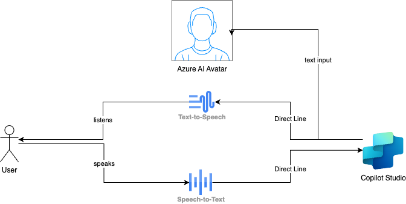
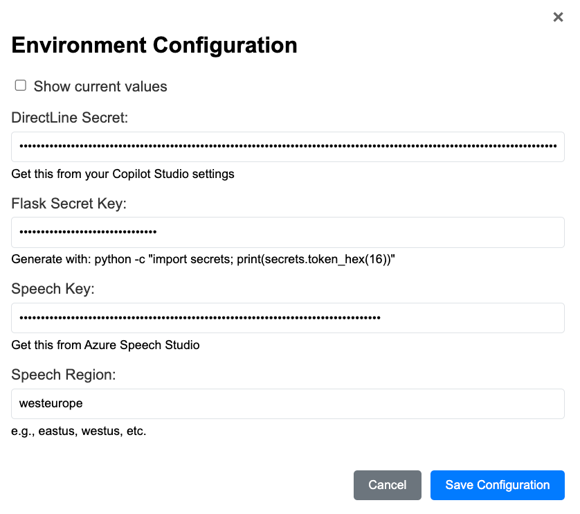
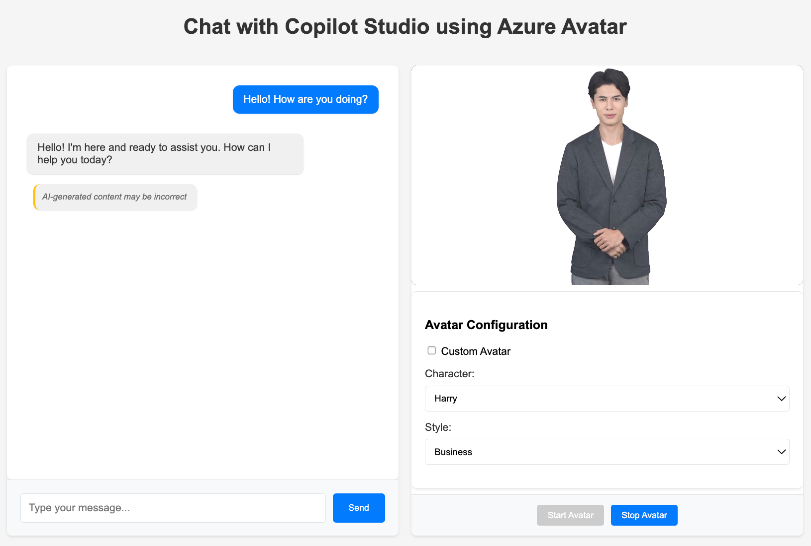
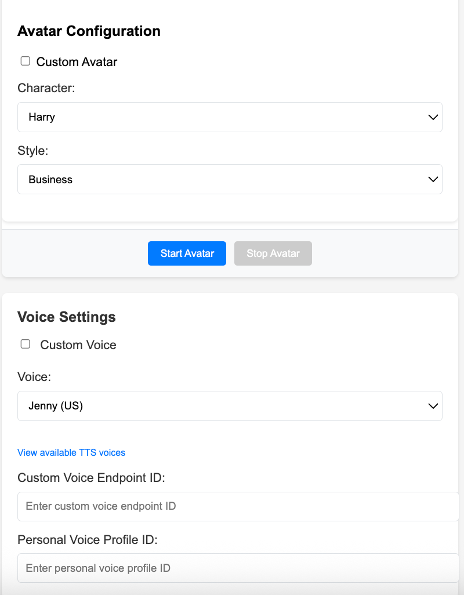

# Copilot Studio Agents & Azure Speech Integration

## Overview
This project integrates Copilot Studio with Azure Speech Services to provide robust capabilities for Text-to-Speech, Speech-to-Text, and Avatar functionalities.

## Architecture



## Features
- Real-time speech recognition and synthesis
- Interactive avatar with customizable voices and styles
- WebRTC-based video streaming
- CSRF protection for secure API endpoints

## Folder Structure
- **app.py**: Main application script that drives the integration.
- **static/**: Contains all static assets.
  - **static/css/chat.css**: CSS styling for the project's chat interface.
  - **static/js/chat.js**: JavaScript code for chat functionalities.
- **templates/**: Holds HTML templates.
  - **templates/index.html**: Main HTML file serving as the project's entry point.
- **images/**: Contains images for documentation.
  - **images/avatar-example.png**: Example of the avatar interface.
  - **images/settings-panel.png**: Configuration panel screenshot.
  - **images/environment-setup.png**: Environment variable configuration window.
- **.env.example**: Sample environment configuration for setting up required variables.

## Prerequisites

- Python 3.9 or higher installed on your machine
- Git installed for repository cloning
- Azure Speech Service subscription
- Copilot Studio bot with Direct Line channel enabled

> **Important Note on Authentication**: 
> To use Direct Line with this application, you must disable authentication in your Copilot Studio bot settings. This means that authentication and security will need to be managed at the application level rather than through Copilot Studio's built-in authentication. This is necessary because the current implementation doesn't support Copilot Studio's authentication flow.

## Getting Started

1. **Clone the Repository**
   ```bash
   git clone https://github.com/nguyennhianhtri/copilot-studio-azure-avatar.git
   cd avatar
   ```

2. **Set Up a Virtual Environment**
   Create and activate a virtual environment to keep dependencies isolated:
   ```bash
   python3 -m venv venv
   source venv/bin/activate  # On Windows, use: venv\Scripts\activate
   ```

3. **Install Dependencies**
   Install all required Python packages using the requirements.txt file:
   ```bash
   pip install -r requirements.txt
   ```

4. **Configure Environment Variables**
   The application provides a web interface for configuring environment variables. When you first run the application, it will automatically detect missing environment variables and display a configuration window.

   

   Required environment variables:
   - `DIRECT_LINE_SECRET`: Your Copilot Studio bot's Direct Line secret
   - `SPEECH_KEY`: Your Azure Speech Service subscription key
   - `SPEECH_REGION`: Your Azure Speech Service region
   - `SECRET_KEY`: A secret key for Flask session management

   You can configure these variables through the web interface, or manually create a `.env` file in the project root with the following format:
   ```
   # DirectLine Secret from Copilot Studio
   DIRECT_LINE_SECRET=your_direct_line_secret

   # Flask Secret Key
   SECRET_KEY=your_secret_key

   # Azure Speech Service Configuration
   SPEECH_REGION=your_speech_region
   SPEECH_KEY=your_speech_key
   ```

5. **Run the Application**
   Start the application with the following command:
   ```bash
   python app.py
   ```
   The application will be available at `http://localhost:5000`

## Usage

1. **Access the Web Interface**
   Open your browser and navigate to `http://localhost:5000`

   

2. **Configure Environment Variables (if needed)**
   - If environment variables are missing, a configuration window will appear automatically
   - Fill in the required values and click "Save"
   - The page will reload automatically with the new configuration

3. **Interact with the Avatar**
   - Use the microphone button to start speech recognition
   - The avatar will respond with both text and speech
   - Customize the avatar's voice and style using the settings panel

   

## Troubleshooting

- If you encounter CSRF errors, ensure you're using the latest version of the application
- For speech recognition issues, verify your Azure Speech Service credentials
- Check the browser console for detailed error messages
- The application includes a debug endpoint at `/debug/logs` for viewing server logs

## Additional Information

For more details about Azure Speech Services and Copilot Studio integration, refer to the official documentation:
- [Azure Speech Services Documentation](https://docs.microsoft.com/en-us/azure/cognitive-services/speech-service/)
- [Copilot Studio Documentation](https://docs.microsoft.com/en-us/microsoft-copilot-studio/)
